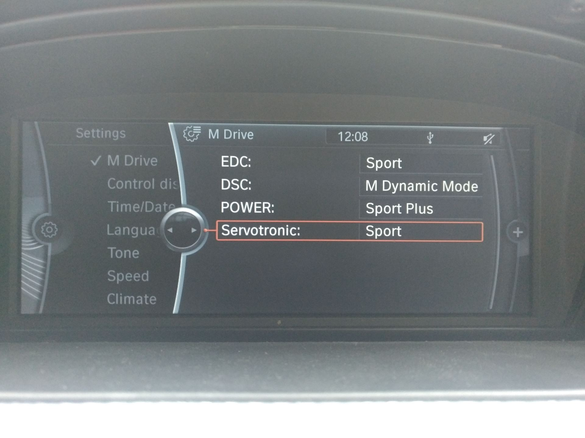
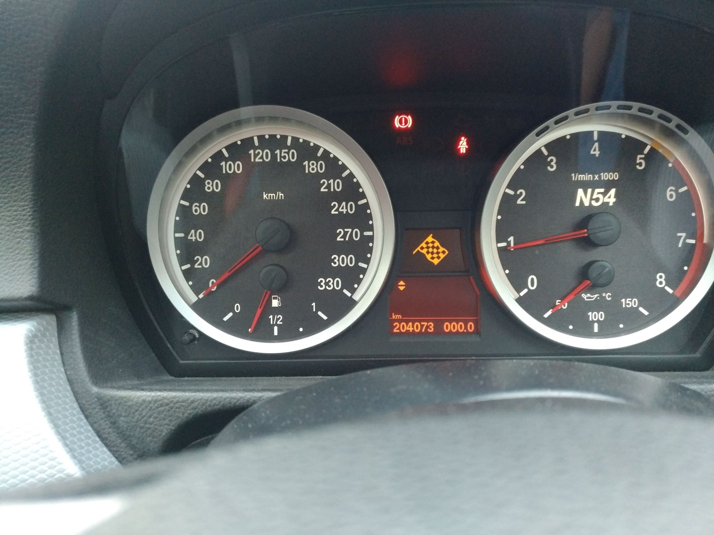
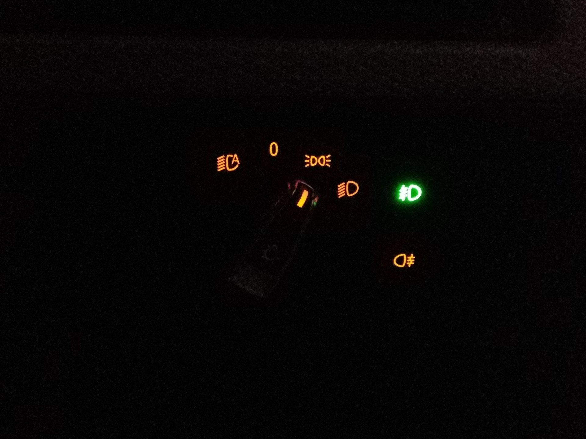
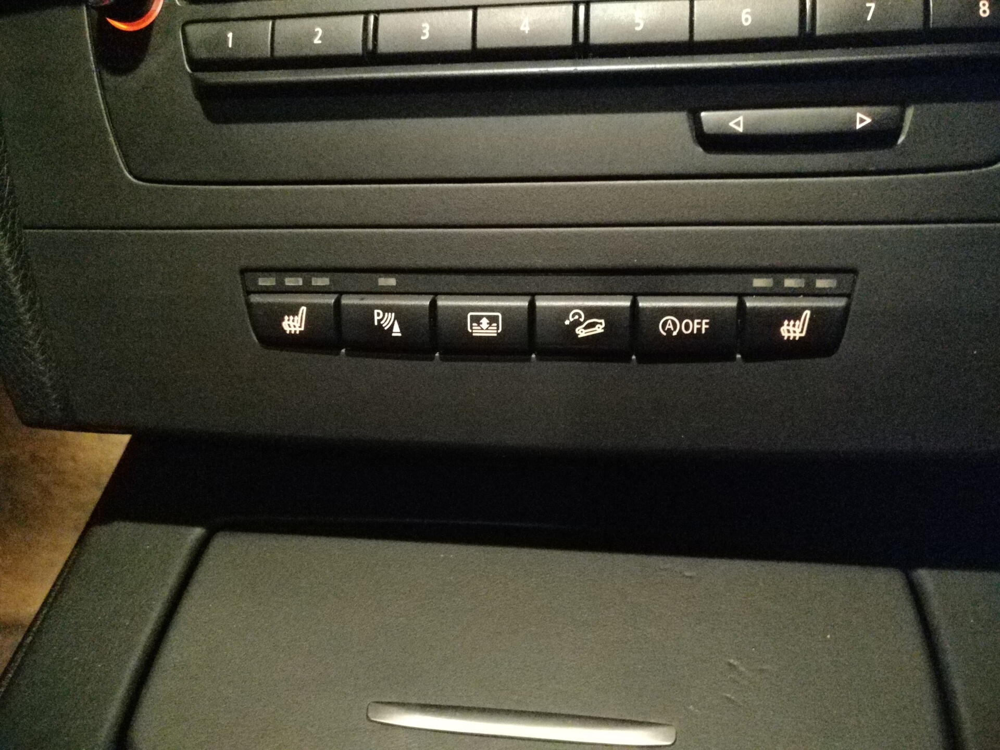
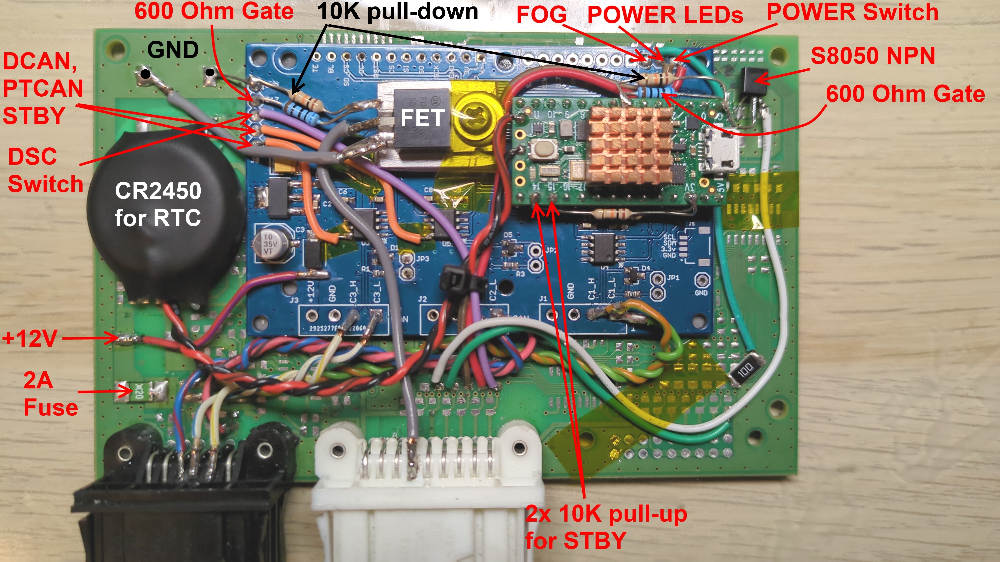

# E9X-M-CAN-Integration-Module
 
Unlike my previous modules, this one has access to PTCAN, KCAN and DCAN. While the code is quite specific for my particular car, much of the CAN message logic may be useful.
Included are also tools to allow full manipulation of the program section in the MSD81 bin file.

Electronics used:
 
* Skpang Triple CAN board https://copperhilltech.com/teensy-4-0-triple-can-bus-board-with-two-can-2-0b-and-one-can-fd-port/ (Teensy 4.0, MCP2562s).
* Small copper heatsink.
* N-channel MOSFET that can be driven with 3V3. I had some FQP50N06Ls.
* S8050 NPN transistor or similar (Steering heater switch).
* 1N4007 diode (exhaust solenoid flyback).
* 2x 10K Ohm (CAN STBY pull-up), 10K Ohm (FET pull-down), 600 Ohm (FET R-gate), 10K Ohm (NPN pull-down), 600 Ohm (NPN R-base), 390 Ohm SMT (POWER LED), and 10 Ohm (Fog LED) resistor.
* OSRAM LO M676-Q2S1 FOG button illumination LED.
* KINGBRIGHT KM2520ZGC-G03 FOG indicator LED.
* Micro USB right-angle cable.
* CR2450 620mAh battery. With a ~0.024 mA draw, the RTC should last around 3 years unpowered (terminal 30G OFF).
	-> https://www.nxp.com/docs/en/nxp/data-sheets/IMXRT1060CEC.pdf P.28 (SNVSS) + P.34 (RTC-OSC).
* Old PDC module PCB and housing. It has nice automotive connectors.
* SVT70 module P/N 6795802.

Required hardware:
* MSD81 DME.
* CIC iDrive.
* MK60E5 or DSC8 (E89 Z4) non-M modules.
* E9X M3 centre console trim and buttons.

Optional hardware:
* E9X M3 EDC system.
* E9X M3 DCT instrument cluster (Shiftlights).
* SVT70 module (Servotronic).
* Dashboard centre buttons with Start-Stop and HDC buttons.

I use it to:

* Control MDrive settings from iDrive.
	* Control DME throttle map with the M button.
	* Control DTC/DSC OFF with the M button.
	* Control EDC mode with the M button.
	* Control Servotronic mode with the M button - through SVT70 module.
	* Control the exhaust flap position with the M button.
	* Display M Drive settings when holding M button
	* Control M Key settings from iDrive.
* Display Shiftlights - including startup animation, sync with the M3 KOMBI variable redline.
* Display a Needle sweep animation on startup.
* Display Launch Control flag.
* Control Centre console buttons and associated LED (POWER, DSC OFF).
* Fold/Un-fold mirrors when locking/unlocking.
* Indicate when the trunk is opened by remote (flash hazards).
* Immobilize the engine with a fuel pump cut-off until the M button is pressed X times.
	* If engine is started without releasing this immobilizer, alarm will sound once engine stalls.
	* Can be disabled persistently by first deactivating then, holding the POWER and DSC OFF buttons for 10s.
* Display Front fog lights ON (for M3 clusters that lack the symbol).
* Audibly warn when reverse gear is engaged.
* Audibly warn when the hood is opened.
* Create a HDC function similar to the one in xDrive cars.
* Display a CC error when pressing the Auto Start-stop button instead of a blank button.
  OR
* Switch on the reversing camera when pressing the Auto Start-stop button.
* Carry out one more wipe cycle after washing the windscreen.
* Enable use of FXX KCAN1 CIC controller.
* Enable use of FXX VSW01 (VideoSWitch) module.
* Enable use of FXX NIVI2/3 module.
* Enable full diagnosis and coding of SVT70 module.
* Turn on heated seats below a set temperature.
* Turn on heated steering below a set temperature.
* Keep time and date in RTC and set back if KOMBI is reset (30G_F, battery removed/flat, coding, etc.).
	* After uploading to Teensy, set the time in iDrive/ISTA to synchronize the RTC to the same time.
* Close the exhaust flap before engine start to reduce start noise.
* Reduce audio volume when opening doors. Restore when closing.
* Dim corresponding front DRL when indicator is on.
* Turn on corresponding front fog light when steering angle threshold is exceeded.

Program:

Message transmission is optimized to reach the receiver module on the shortest route. I.e. messages that need to reach KOMBI are sent on KCAN even if the BMW implementation would have sent it over PTCAN. This is done to minimize any gateway (JBE) delay.
Functions that make use of CANID 0x6F1 (iDrive volume, SVT_70 gateway, etc.) are deactivated if communication on the DCAN from an OBD tool is detected.
Wherever pausing is required (dtc/dsc off for example), FiFo queues are implemented to ensure reading and processing of messages is unaffected.
A serial module is implemented to allow basic manipulation during runtime. Default password to unlock is "coldboot". "help" prints the available commands.

Arduino IDE settings

Board: Teensy 4.0
Optimize: Fastest with LTO
CPU Speed: 528 MHz
USB Type: Dual Serial for debugging, Single for normal operation.

MSD81 IKM0S binary modification

[PROGRAM]

0x83738   and  0x83739  -> 1F 03      CAN message table
0x1F3AD4  and  0x1F3AD5 -> 1F 03      CAN filters

Replace 15 03 (0x315 represented in Little Endian) to stop MSD81 from reacting to Vehicle Mode changes (triggered by JBBF through EDC button)
This also allows state_spt (throttle map) to be controlled independently from the main "MDrive" with the console switch.
Re-calculate checksum at 0x80304 using csprogram-windows.exe. Alternatively, this XDF contains definitions for the CAN IDs: https://github.com/superwofy/Superwofy-IKM0S-XDF.

[MAP]

lc_var_spt_swi at 0x4CD1D set to 00. This disables the DME 1M MDrive logic. 0x399, 0x1D9 etc.
By default the DME hard-codes the MDrive values for Servotronic, EDC etc. In order to replace them, these functions need to be disabled.