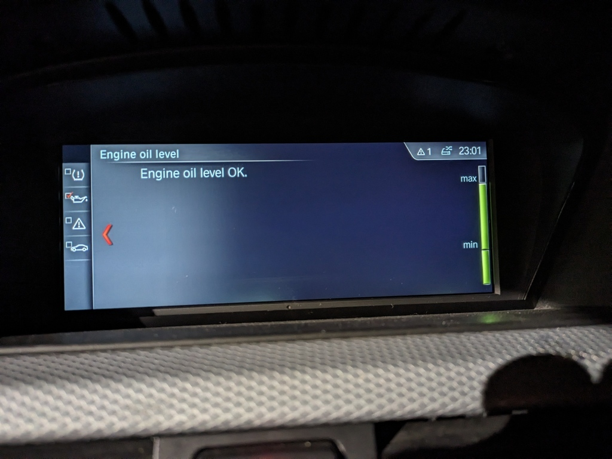
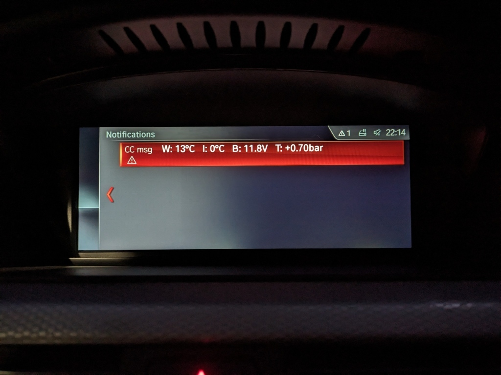
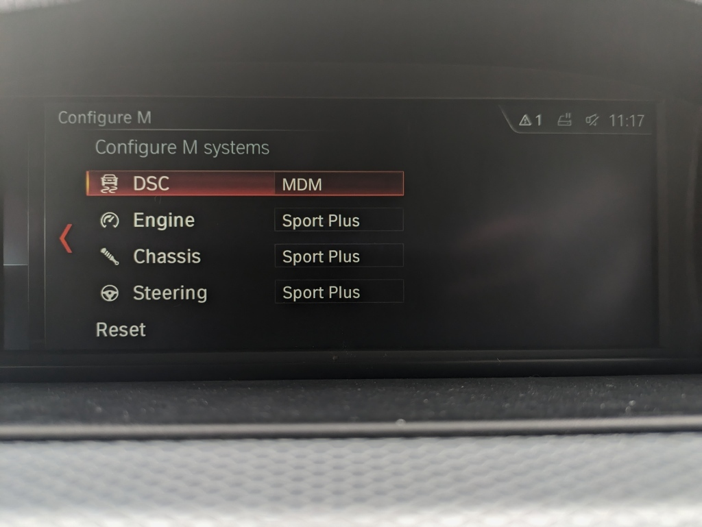
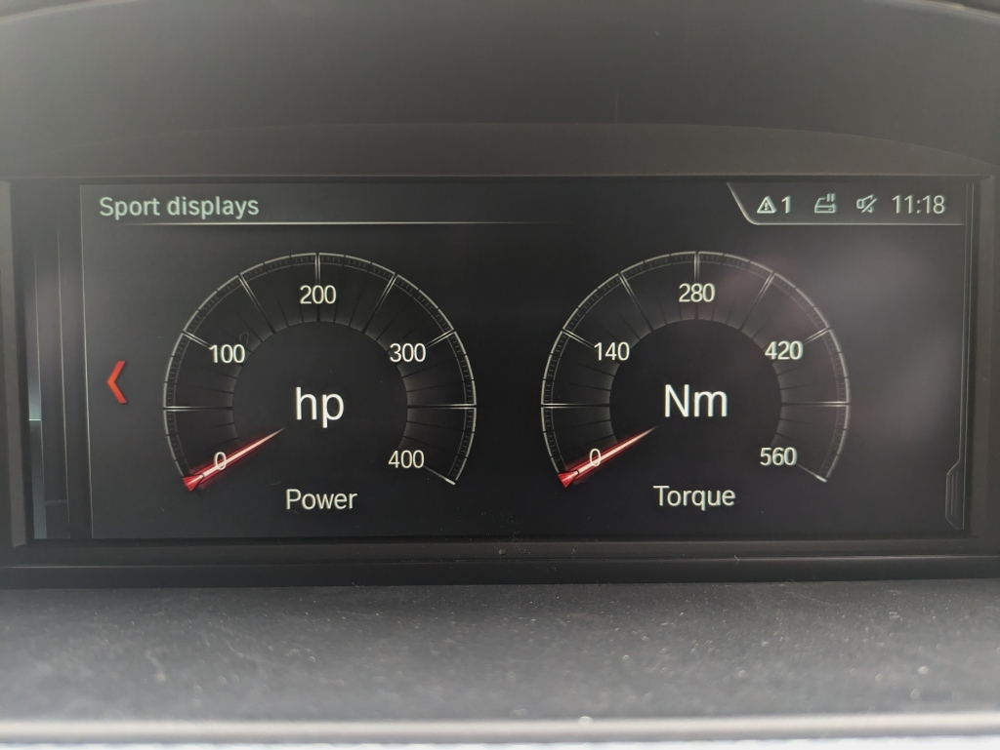
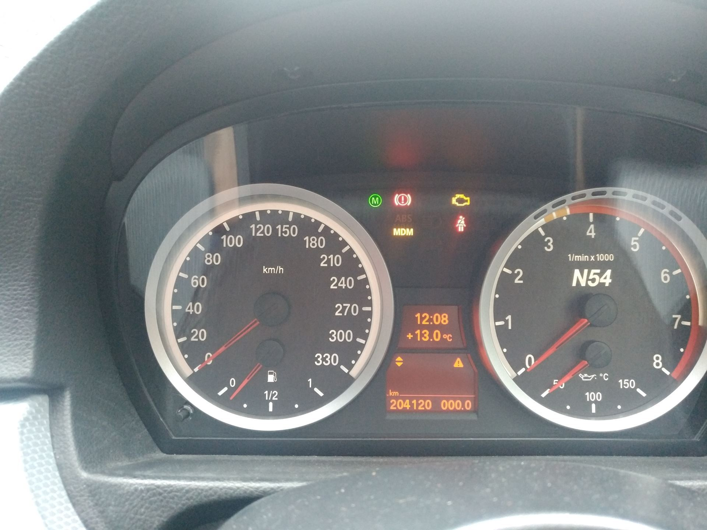

# E9X-M-CAN-Integration-Module
 
I designed this module to integrate additional functionality into my '08 E92 335i.
With full access to the K-CAN, PT-CAN and D-CAN, functionality can be added, modified or suppressed. This enables the use of FXX modules and radios, MDrive and more.
While the code is quite specific for my particular car, much of the CAN message logic may be useful.
Included are also tools to allow full manipulation of the program section in the MSD81 bin file.

**Electronics used:**
 
* Skpang Triple CAN board https://copperhilltech.com/teensy-4-0-triple-can-bus-board-with-two-can-2-0b-and-one-can-fd-port/ (Teensy 4.0, MCP2562s).
* MCP2515 board for NBT EVO emulation.
* Small copper heatsink.
* N-channel MOSFET that can be driven with 3V3. I had some FQP50N06Ls.
* S8050 NPN transistor or similar (Steering heater switch).
* 1N4007 diode (exhaust solenoid flyback).
* 2x 10K Ohm (CAN STBY pull-up), 10K Ohm (FET pull-down), 600 Ohm (FET R-gate), 10K Ohm (NPN pull-down), 600 Ohm (NPN R-base), 390 Ohm SMT (POWER LED), and 10 Ohm (Fog LED) resistor.
* OSRAM LO M676-Q2S1 FOG button illumination LED.
* KINGBRIGHT KM2520ZGC-G03 FOG indicator LED.
* Micro USB right-angle cable.
* Old PDC module PCB and housing. It has nice automotive connectors.
* SVT70 module P/N 6795802.

**Required hardware:**
* MSD81 DME.
* NBT EVO/CIC iDrive.
	* ID6 EVO has now replaced the head unit used in this project. Previous CIC functionality is still available but no longer tested.
* MK60E5 or DSC8 (E89 Z4) non-M modules.
* E9X M3 centre console trim and buttons or similar.

**Optional hardware:**
* E9X M3 EDC system.
* E9X M3 DCT instrument cluster (Shiftlights).
* SVT70 module (Servotronic).
* Dashboard centre buttons with Start-Stop (or Camera) and HDC buttons.
* Folding mirrors.
* Electric, memory seats.
* TRSVC.

**I use it to:**

* Emulate K-CAN2 for NBT EVO support.
	* Interface to the CIC faceplate UART.
	* Donor VIN is obtained after every boot when Terminal R is ON. Disable if using own FSCs.
	* Sport displays are populated with PT-CAN torque data from the DME.
	* xDrive status data populated with pitch and roll obtained from the alarm siren (SINE).
	* A BN2000 -> BN2010 message translation overview can be found here: [nbt-messages](CAN%20messages/Message%20translation%20for%20NBT.txt)
	* Control RAD_ON through the ASD module (pin 7).
	* Relay information through custom CC dialogs (Climate, DSC, errors etc.).
	* Display some rudimentary gauges through a persistent notification in the CC list:
		* Terminal R: Coolant temperature and Battery voltage.
		* Ignition: Coolant temperature, Battery voltage and Intake Air Temperature.
		* Engine running: Coolant temperature, Battery voltage, Intake Air Temperature and Turbo pressure.
		* Engine running+MDrive: Intake Air Temperature, Turbo pressure and Turbo bar gauge.
	* Control high beam assistant persistently by pushing away and holding the indicator stalk for 5s.
	* Implement ENT_MODE and associated power saving.
* Control MDrive settings from iDrive.
	* Control DME throttle map with the M button.
	* Control DTC/DSC OFF with the M button.
	* Control EDC mode with the M button.
	* Control Servotronic mode with the M button - through SVT70 module.
	* Control AHL swivel speed mode (sport/comfort) with the M button.
	* Control the exhaust flap position with the M button.
	* Control ASD with the M button.
	* Display M Drive settings menu when holding M button
* Display Shiftlights - including startup animation and sync with the M3 KOMBI variable redline.
* Display a needle sweep animation on startup.
	* On NBT EVO sports displays do a sweep also.
* Display the Launch Control flag (6MT-MHD).
* Control Centre console buttons and associated LED (POWER, DSC OFF).
* Fold/Un-fold mirrors when locking/unlocking.
* Un-dim electrochromic exterior mirrors when indicating at night.
* Move driver's seat back when exiting car.
* Indicate that the windows and sunroof are fully closed by remote (flash hazards 1x - long).
* Indicate when the trunk is opened by remote (flash hazards 2x).
	* Visual signal for locking/unlocking must be ON.
* Indicate when the car is locked and the lock button is pressed (flash hazards + angel eyes 3x).
	* Car must be locked for at least 10s and Visual signal for locking/unlocking must be ON.
	* After 3 activations, xenons flash as well.
	* After 4 activations, xenons flash and alarm beeps.
* Force sleep mode (KL30G OFF) by holding remote lock button for 20s - for testing.
* Immobilize the engine with a fuel pump cut-off until the M button is pressed X times.
	* If engine is started without releasing this immobilizer, alarm will sound once engine stalls.
	* Can be disabled persistently by first deactivating then, holding the POWER and DSC OFF buttons for 10s with the ignition ON.
* Display Front fog lights ON (for M3 clusters that lack the symbol).
* Audibly warn when reverse gear is engaged.
* Audibly warn when the hood is opened.
* Create a HDC function similar to the one in xDrive cars.
* Display a CC error when pressing the Auto Start-stop button instead of a blank button.
  OR
* Switch on the reversing camera when pressing the Auto Start-stop button.
* Carry out one more wipe cycle after washing the windscreen.
* Have intermittent wipers work alongside rain sensing.
	* Push the stalk down and hold for 1.3s to turn on intermittent mode.
	* AUTO, stalk pushed up 1 and stalk pushed up 2 disable intermittent mode.
* Control headlight washing after a number of windscreen wash/wipe cycles instead of the default JBE logic.
* Enable use of FXX VSW01 (VideoSWitch) module.
* Enable use of FXX NIVI2/3 module.
* Enable diagnosis encoding and flashing through Tool32 and E-Sys for F series modules via J2534 passthru over D-CAN.
	* For E-sys a custom SVT is used. See my example [SVT](SVT.xml).
	* Tested with pttbmw_2.1.0.0 (32-bit Java only!) and GM MDI.
* Enable full diagnosis and coding of SVT70 module.
* Turn on heated seats below a set temperature.
* Turn on heated steering below a set temperature.
* Automatically turn off PDC when parked and pulling handbrake.
* Automatically activate tow view rear view camera option when close to an obstacle.
* Close the exhaust flap before engine start to reduce start noise.
* Reduce audio volume when opening doors. Restore when closing.
* Dim corresponding front DRL when indicator is on.
* Turn on corresponding front fog light when steering angle threshold is exceeded.
* Access KCAN/KCAN2 frames over the third USB Serial port with SavvyCAN.
	* Set CAN Bus Speed to 100000 for KCAN and 500000 for KCAN2.

**Program:**

Message transmission is optimized to reach the receiver module on the shortest route. I.e. messages that need to reach KOMBI are sent on K-CAN even if the BMW implementation would have sent it over PT-CAN. This is done to bypass any gateway (JBE) delays.
Functions that make use of CANID 0x6F1 (iDrive volume, SVT_70 gateway, etc.) are deactivated if communication on D-CAN from an OBD tool is detected.
FiFo queues are implemented to ensure reading and processing of messages is not blocked by delays.
A serial interface with a set of commands is implemented to allow manipulation during runtime. The default password to unlock it is "coldboot". "help" prints the available commands.

**Arduino IDE settings:**

Board: Teensy 4.0  
Optimize: Faster with LTO  
CPU Speed: 396 MHz  
USB Type: Single for normal operation, Dual for serial status and Triple Serial for CAN USB interface,   

To make some startup time critical functions work, the following changes should be made to startup.c:  
(Linux path: /home/**Username**/.arduino15/packages/teensy/hardware/avr/**Version**/cores/teensy4/startup.c)  
Comment these lines:  
	usb_pll_start();  
	while (millis() < TEENSY_INIT_USB_DELAY_BEFORE) ;  
	usb_init();  
	while (millis() < TEENSY_INIT_USB_DELAY_AFTER + TEENSY_INIT_USB_DELAY_BEFORE) ; // wait  
  
Optionally, modify usb.c:  
Comment:  
	delay(25);  

**MSD81 IKM0S binary modification:**

[PROGRAM]

0x83738   and  0x83739  -> 1F 03      (CAN message table)  
0x1F3AD4  and  0x1F3AD5 -> 1F 03      (CAN filters)  

Replace 15 03 (0x315 represented in Little Endian) to stop MSD81 from reacting to Vehicle Mode changes (triggered by JBBF through EDC button).  
This also allows state_spt (throttle map) to be controlled independently from the main "MDrive" with the console switch.  
Alternatively, this XDF contains definitions for the CAN IDs: https://github.com/superwofy/Superwofy-IKM0S-XDF.  
Re-calculate checksum at 0x80304 using csprogram-windows.exe.  

[MAP]

lc_var_spt_swi at 0x4CD1D set to 00. This disables the DME 1M MDrive logic. 0x399, 0x1D9 etc.  
By default the DME hard-codes the MDrive values for Servotronic, EDC etc. In order to replace them, these functions need to be disabled.